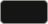
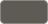

# lorisdalsanto.dev

Loris Dal Santo personal web site.

Sito statico one-page in italiano e inglese, pubblicato su GitHub Pages.

```bash
npm install
npm run dev     # sviluppo: http://localhost:3000/it/ e /en/
npm run build   # genera out/, deployabile su qualsiasi hosting statico
npm run lint
```

## Stack

| Cosa | Versione | Uso |
| --- | --- | --- |
| [Next.js](https://nextjs.org) | 16.1 | App Router, static export (`output: "export"`), route `[lang]` generate con `generateStaticParams`, `next/font`, `proxy.ts` |
| [React](https://react.dev) | 19.2 | Server Components per le sezioni, un solo Client Component (`Motion`) |
| [TypeScript](https://www.typescriptlang.org) | 5.9 | Tipi dei contenuti in `src/models/` |
| [Tailwind CSS](https://tailwindcss.com) | 4.3 | Stili; token di colore in `src/app/globals.css` via `@theme` |
| [GSAP](https://gsap.com) | 3.15 | Animazioni: SplitText (titolo riga per riga), ScrollTrigger (linee e contenuti allo scroll), `@gsap/react` (`useGSAP`) |
| [ESLint](https://eslint.org) | 9.39 | `eslint-config-next` (core-web-vitals + TypeScript) |
| [Prettier](https://prettier.io) | - | Formattazione con le impostazioni predefinite (dall'editor, non è in `package.json`) |
| Google Fonts | - | Schibsted Grotesk (testo), IBM Plex Mono (metadati), serviti da `next/font` |
| GitHub Actions + GitHub Pages | - | Build e deploy a ogni push su `main` |

Scelte principali:

- **Nessuna libreria i18n**: due lingue con testi statici, gestite con il segmento `[lang]` e i file in `src/content/`, come nella guida Internationalization di Next.js.
- **Accessibilità**: con "riduci animazioni" attivo nel sistema non si anima nulla; il titolo resta leggibile anche senza JavaScript.
- **Branch**: si lavora su `develop` (tramite branch di feature e pull request), `main` è solo per il deploy.

## Struttura

Tutto il codice sta in `src/`; nella root restano solo le configurazioni.

```
src/
  app/
    (public)/               pagine pubbliche (in futuro: (private) con login, api/)
      [lang]/               lingua nell'URL: /it/, /en/
        layout.tsx          <html>, font, metadati
        page.tsx            la landing
        _landing-sections/  sezioni della landing (Hero, Work, About, Contact, Section)
        privacy/page.tsx    informativa privacy
    global-not-found.tsx    pagina 404 unica e bilingue
    robots.ts, sitemap.ts   robots.txt e sitemap.xml
    icon.png, apple-icon.png  favicon e icona per iOS
    globals.css
  components/layout/        componenti condivisi tra pagine (Header, Footer)
  content/                  testi per lingua (it.ts, en.ts) e dati comuni (profile.ts)
  lib/
    i18n/                   lingue supportate (locales.ts) e accesso ai testi (index.ts)
    motion/                 animazioni GSAP (Motion.tsx)
    site/                   indirizzo del sito, metadati (Open Graph, canonical, hreflang), font
  models/                   tipi dei dati, un file *.model.ts per tipo
  proxy.ts                  redirect alla lingua (solo con hosting con server)
public/index.html           "/" → lingua del browser sull'export statico
public/og.png               immagine di anteprima per i social (1200x630)
```

- Ogni pagina è un `page.tsx` con accanto i suoi componenti in una cartella `_nome/` (es. `_landing-sections/`): il trattino basso dice a Next che non è una route.
- I gruppi tra parentesi, come `(public)`, non finiscono nell'URL.
- Non si usa `src/pages/`: in Next è riservata al Pages Router.

Per aggiungere una lingua: nuovo file in `src/content/`, poi aggiungila a `locales` in `src/lib/i18n/locales.ts`, a `contents` in `src/lib/i18n/index.ts` e a `supported` in `public/index.html`.

## Deploy

Ogni push su `main` pubblica il sito su GitHub Pages (`.github/workflows/deploy.yml`).
Prerequisito, una volta sola: Settings → Pages → Source: **GitHub Actions**.

Senza dominio il sito è su `https://thedollmaster98.github.io/lorisdalsanto.dev/`: il workflow
passa la sottocartella a Next tramite `PAGES_BASE_PATH` e l'indirizzo completo tramite `SITE_URL`
(usato per canonical, hreflang, Open Graph, sitemap e robots). Con un dominio personalizzato
entrambi si aggiornano da soli.

`robots.txt` viene letto dai motori di ricerca solo alla radice del dominio: in sottocartella è
presente ma inefficace, diventa utile con il dominio proprio.

## Design

### Palette

Definita una sola volta in `src/app/globals.css` (variabili CSS in `:root`, esposte a Tailwind con `@theme`).
Nessun gradiente, nessuna ombra: il sito usa solo questi sei colori.

| Colore | Token | Hex | Classe Tailwind | Uso | Contrasto su `paper` |
| --- | --- | --- | --- | --- | --- |
|  | `paper` | `#F4F2EE` | `bg-paper` | Sfondo della pagina (bianco perla) | - |
|  | `paper-raised` | `#EBE8E2` | `bg-paper-raised` | Hover delle righe dei progetti | - |
|  | `ink` | `#151515` | `text-ink`, `bg-ink` | Testo principale, sottolineatura dell'email, selezione | 16.3:1 |
|  | `ink-muted` | `#5E5B55` | `text-ink-muted` | Testo secondario, etichette, date, metadati | 6.1:1 |
|  | `line` | `#D9D5CD` | `border-line`, `bg-line` | Linee sottili e separatori (decorativi) | - |
|  | `signal` | `#3F7A4A` | `bg-signal` | Solo il pallino "Aperto a nuove opportunità" | 4.6:1 |

Tutti i colori usati per il testo superano il livello AA delle WCAG (4.5:1) sullo sfondo.
Per cambiare un colore basta modificare la variabile in `:root`: le classi Tailwind si aggiornano da sole.

### Tipografia

- **Schibsted Grotesk**: testo e titoli (`font-sans`)
- **IBM Plex Mono**: etichette, date e metadati (`font-mono`)

Entrambi caricati da Google Fonts tramite `next/font`, quindi serviti dal sito stesso, senza richieste a Google dal browser.

### Perché queste scelte

Lo stile è **editoriale**, ispirato allo Stile tipografico internazionale (o "Svizzero"): griglia a colonne, tipografia grande come elemento principale, allineamenti rigorosi, pochissima decorazione. Le etichette numerate (`00 / Presentazione`) e le linee sottili a tutta larghezza vengono da lì. Il contenuto resta in una colonna di 1280px, mentre le linee arrivano ai bordi: è quel contrasto a tenere tutto sulla stessa griglia.

Alcune scelte vengono dalla richiesta iniziale, non da una fonte: niente gradienti ed effetti "generati", un bianco che sembri premium invece del bianco puro.

- **Bianco perla invece di `#FFFFFF`.** `#F4F2EE` è un bianco caldo che richiama la carta: meno freddo e "da applicazione" del bianco puro, coerente con l'impostazione editoriale.
- **Nero morbido invece di `#000000`.** `#151515` resta a 16:1 di contrasto sullo sfondo, ben oltre il minimo, ma è meno duro del nero puro accanto a un bianco caldo. Usare grigi leggermente saturati (qui verso il caldo) invece di grigi neutri è un consiglio di *Refactoring UI*.
- **Un solo colore d'accento, con un solo significato.** Il verde `signal` compare solo nel pallino "disponibile": un colore usato ovunque smette di comunicare qualcosa.
- **Contrasto AA.** I colori del testo rispettano il minimo di 4.5:1 delle WCAG 2.2 (criterio 1.4.3), calcolato sullo sfondo `paper`.
- **Righe corte.** Il titolo è limitato a 20 caratteri per riga e la presentazione a 46 caratteri. I testi lunghi si leggono meglio tra i 45 e i 90 caratteri per riga (*Practical Typography*).
- **Font.** Schibsted Grotesk è un grottesco contemporaneo con carattere proprio, e toglie al sito l'aspetto generico dei font più usati (Inter, Geist). IBM Plex Mono, monospaziato, separa visivamente i metadati (date, ruoli, tecnologie) dal testo.
- **Animazioni.** Poche e lente, tutte con la stessa curva: rivelano il contenuto e non lo decorano. Con "riduci animazioni" attivo nel sistema non si anima nulla (`prefers-reduced-motion`, criterio WCAG 2.3.3).

### Fonti

- Josef Müller-Brockmann, *Grid Systems in Graphic Design* (Niggli, 1981): il riferimento sullo Stile tipografico internazionale e sulle griglie.
- Adam Wathan e Steve Schoger, *Refactoring UI*: https://www.refactoringui.com/
- Matthew Butterick, *Practical Typography*, "Line length": https://practicaltypography.com/line-length.html
- W3C, *WCAG 2.2*, criteri 1.4.3 (Contrast Minimum) e 2.3.3 (Animation from Interactions): https://www.w3.org/TR/WCAG22/
- MDN, `prefers-reduced-motion`: https://developer.mozilla.org/en-US/docs/Web/CSS/@media/prefers-reduced-motion
- Schibsted Grotesk su Google Fonts: https://fonts.google.com/specimen/Schibsted+Grotesk
- IBM Plex: https://www.ibm.com/plex/

## AI full disclosure

- This software is developed with strong assistance from AI coding agents and with humans leading the ideas, testing, and debugging. We say this openly because it shaped how the project was built. If you are not happy with AI-developed code, this software is not for you. The acknowledgement is equally important: this would not exist without the open-source projects it is built on, largely written by hand (Next.js, React, Tailwind CSS and GSAP).
