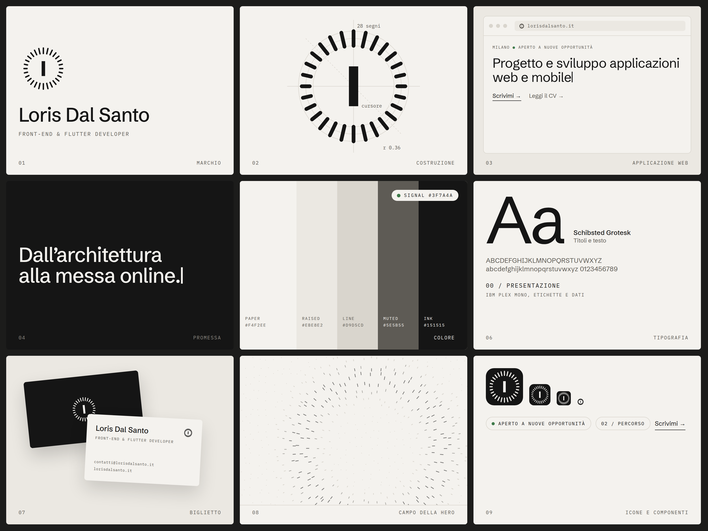

# Revisione del design, ottobre 2026

Branch di lavoro: `design/brand-review`. Niente qui va online finché non viene unito.

`board.png` è generato da `board.html`, a sua volta prodotto da `gen_board.py` (colori e font sono quelli di `src/app/globals.css`).

## Cosa funziona già

- **Palette disciplinata.** Paper, ink, un solo accento (signal verde) usato solo per la disponibilità. Niente gradienti, niente colori a caso. Regge.
- **Coppia tipografica giusta.** Schibsted Grotesk per i titoli, IBM Plex Mono per etichette e dati. Ruoli chiari, non si pestano.
- **Etichette numerate** (`00 / Presentazione`). Danno struttura da documento tecnico, coerente con il mestiere.
- **Un motivo vero.** Il campo di segni della hero e il cursore del titolo sono già un'identità. Mancava solo il marchio che li riassume.

## Cosa manca o non va

1. **Non c'è un marchio.** L'icona del sito è "LD" scritto in un font di sistema. In tab del browser, favicon, anteprime e biglietto non dice niente. È il buco più grande.
2. **Il cursore che scrive il titolo ritarda il contenuto.** Bello la prima volta, costa all'LCP sempre. Da accorciare o da far partire con il testo già visibile.
3. **I testi dei progetti sono lunghi e sanno di AI.** Problema di contenuto, non di design, ma il layout li mette al centro: card da 5 righe dense pesano più del resto della pagina.
4. **Il signal verde è usato una volta sola.** Va bene così. Non aggiungerlo a link o bottoni: perderebbe il significato di "disponibile".

## Proposta: il marchio "campo e cursore"

- **Idea.** Il cursore al centro del campo: il punto in cui si costruisce, dentro un sistema ordinato. Riprende due cose che il sito ha già (anello di segni della hero, cursore del titolo), quindi non è un logo appiccicato.
- **Costruzione.** 28 segni radiali su un anello di raggio 0.36 del lato, più lunghi in alto e in basso; barra del cursore al centro, larga 0.07 e alta 0.30.
- **Usi.** Favicon e icona app (bianco su ink, angoli 22%), biglietto, intestazione del CV, anteprima social.
- **Limite noto.** A 16 px i 28 segni si impastano (si vede nel pannello 09). Serve una versione ridotta per le misure piccole: 12 segni più spessi, oppure solo cursore dentro un cerchio.

## Prossimi passi, in ordine

1. Decidere se il marchio va bene. Se sì: versione 16/32 px semplificata, poi favicon, `apple-icon` e anteprima social rigenerati.
2. Accorciare il titolo animato (o testo subito visibile, cursore solo alla fine).
3. Riscrivere i testi dei progetti con parole tue, 2 o 3 frasi ciascuno.

Il resto del design non va toccato: è già sopra la media e cambiarlo adesso è tempo tolto alle candidature.
